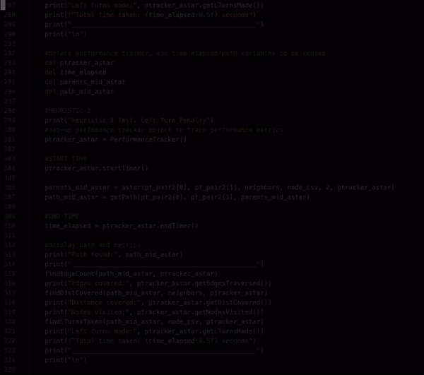

# Evaluation of A* Shortest Pathfinding on Real Map Data 
### Code used to evaluate A* search for CSCI 4511W Final Project

## Summary
Using a set of performance metrics, A* search is evaluated on real-life map data. This repository includes all the files necessary to run outlined tests on two sets of map data of varying sizes.

## Map Data
CSV files are included representing maps of the following locations:
* Oldenburg, Germany (6,105 nodes)
* San Francisco, CA, USA (174,956 nodes)

Datasets found [here.](https://www.cs.utah.edu/~lifeifei/SpatialDataset.htm)

## Tests Performed
A basic A* search algorithm is evaluated in a couple different circumstances. 
Note: The A* code used is written based on publicly available resource included [here.](https://www.redblobgames.com/pathfinding/a-star/introduction.html)

### Uninformed vs. Informed

Although the focus of this project is A* search, Uniform Cost Search is also run in order to highlight the performance increase with an informed search algorithm.
The UCS code included in based off of [this](https://github.com/DeepakKarishetti/Uniform-cost-search), with a number of additional modifications made to fit this specific project.

### Heuristics

Three different, admissible heuristics are tested with the basic A* algorithm.
* Heuristic #1: Euclidean Distance between potential next node and goal node
* Heuristic #2: Added Left Turn Penalty
* Heuristic #3: Goal Direction Bonus

## Usage
`python3 main.py`

## Output

